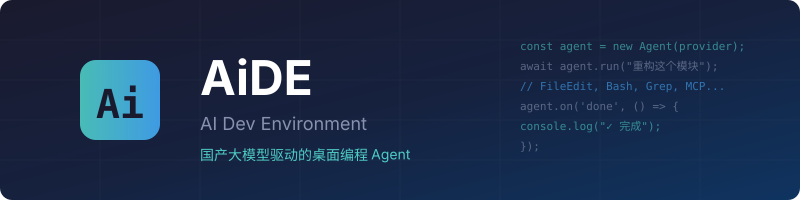

<p align="center">
  
</p>

<h1 align="center">AiDE — AI Dev Environment</h1>

<p align="center">
  <strong>国产大模型驱动的桌面编程 Agent</strong><br>
  功能对齐 Claude Code + Codex，原生支持 DeepSeek / Qwen / GLM / Kimi / 豆包 / MiniMax
</p>

<p align="center">
  
  
  
  
</p>

<p align="center">
  
  &nbsp;&nbsp;
  
  &nbsp;&nbsp;
  
  &nbsp;&nbsp;
  
  &nbsp;&nbsp;
  
  &nbsp;&nbsp;
  
</p>

---

## 为什么选择 AiDE？

| 对比 | Claude Code | Codex | AiDE |
|------|-------------|-------|------|
| 模型支持 | Claude only | GPT only | **6+ 国产模型 + 任意 OpenAI 兼容 API** |
| 桌面应用 | Electron (~150MB) | Electron | **Tauri (~5MB)** |
| 开源 | ❌ | 部分 | **✅ Apache-2.0** |
| 中文优化 | 一般 | 一般 | **原生中文 UI + 中文模型** |
| 自定义 API | 需 hack | 需 hack | **原生支持 base_url + key** |
| 价格 | $20/月起 | $20/月起 | **按量付费，用国产模型低至 ¥0.001/次** |

## 功能全景

### 核心 Agent 能力

- **文件操作**: 读取、创建、编辑（精确字符串替换）、Jupyter Notebook 编辑
- **代码搜索**: Glob 文件匹配 + Grep 内容搜索（支持 ripgrep）
- **终端执行**: Bash / PowerShell，超时控制，后台运行
- **Web 能力**: 网页搜索、URL 内容抓取
- **Node REPL**: 持久化 JavaScript 执行环境
- **后台监控**: 日志监听、文件变更、进程监控
- **定时任务**: Cron 表达式调度，一次性或循环

### 桌面应用功能

- **多面板布局**: 聊天 + 终端 + 文件树 + Diff 预览
- **Visual Diff**: 行级对比，接受/拒绝/编辑每个 hunk
- **命令面板**: Ctrl+Shift+P 快速操作（类 VS Code）
- **Plan Mode**: 复杂任务先规划再执行
- **任务追踪**: 浮动任务清单，实时进度
- **Token 用量**: 实时显示消耗和估算费用
- **系统托盘**: 后台运行，快速唤起
- **会话管理**: 保存、恢复、搜索历史对话

### 安全与权限

- **三级权限**: Safe（需审批）/ Trusted（自动执行）/ Locked（只读）
- **审批弹窗**: 危险操作前弹窗确认，可记住选择
- **文件沙箱**: 限制写入范围到工作目录
- **命令分类**: 自动识别高危命令（rm -rf, git push --force 等）

### 扩展性

- **MCP 协议**: 连接任意 MCP 工具服务器
- **插件系统**: npm 包格式，注册自定义工具和命令
- **Git 集成**: 分支、提交、PR、Worktree 隔离
- **多 Provider**: 运行时切换模型，支持 fallback 链

---

## 快速开始

### 环境要求

- Node.js 22+
- pnpm 9+
- Rust stable（用于编译 Tauri 桌面壳）
- Windows 10+ / macOS 12+ / Linux

### 安装与运行

```bash
# 克隆仓库
git clone https://github.com/AiDE-dev/aide.git
cd aide

# 安装依赖
pnpm install

# 开发模式（启动桌面应用 + 热重载）
pnpm --filter @aide/desktop tauri dev

# 或仅使用 CLI
pnpm --filter @aide/cli dev -- --provider deepseek --key sk-xxx "你好"
```

### 生产构建

```bash
# 构建桌面应用安装包
pnpm --filter @aide/desktop tauri build

# 产物位置:
# Windows: packages/desktop/src-tauri/target/release/bundle/msi/
# macOS:   packages/desktop/src-tauri/target/release/bundle/dmg/
# Linux:   packages/desktop/src-tauri/target/release/bundle/appimage/
```

---

## 配置

### 首次使用

启动后在设置面板中：
1. 选择 Provider（下拉菜单）
2. 输入 API Key
3. 选择模型
4. 点击「测试连接」

### 支持的 Provider

| Provider | 获取 API Key | 推荐模型 | 特色 |
|----------|-------------|----------|------|
| DeepSeek | [platform.deepseek.com](https://platform.deepseek.com) | deepseek-chat, deepseek-reasoner | 性价比最高，R1 推理强 |
| 通义千问 | [dashscope.console.aliyun.com](https://dashscope.console.aliyun.com) | qwen-max, qwq-plus | 长上下文，QwQ 推理 |
| 智谱 GLM | [open.bigmodel.cn](https://open.bigmodel.cn) | glm-4-plus | 128K 上下文，多模态 |
| Kimi | [platform.moonshot.cn](https://platform.moonshot.cn) | moonshot-v1-128k | 超长上下文 |
| 豆包 | [console.volcengine.com/ark](https://console.volcengine.com/ark) | doubao-1.5-pro-256k | 256K 上下文 |
| MiniMax | [platform.minimaxi.com](https://platform.minimaxi.com) | MiniMax-Text-01 | 百万 token 上下文 |
| 自定义 | — | — | 任意 OpenAI 兼容 API |

### 配置文件

```toml
# ~/.aide/config.toml

[provider]
id = "deepseek"
base_url = "https://api.deepseek.com"
api_key = "sk-xxx"
model = "deepseek-chat"

[agent]
max_iterations = 50
thinking_enabled = true
permission_mode = "safe"

[[mcp.servers]]
name = "filesystem"
command = "npx"
args = ["-y", "@modelcontextprotocol/server-filesystem", "./"]
```

---

## CLI 使用

```bash
# 单次对话
aide "解释这个项目的架构" --provider deepseek --key sk-xxx

# 交互模式
aide -p qwen -k sk-xxx

# 自定义 endpoint
aide --base-url https://your-api.com/v1 --key sk-xxx --model custom-model

# 指定工作目录
aide -d /path/to/project "添加单元测试"

# 启用思考模式
aide --thinking "设计一个缓存系统"
```

---

## 架构

```
┌─────────────────────────────────────────────────────────┐
│                    Desktop (Tauri v2)                     │
│  ┌─────────┐ ┌──────┐ ┌────────┐ ┌──────┐ ┌─────────┐ │
│  │  Chat   │ │ Diff │ │Terminal│ │Files │ │Settings │ │
│  └────┬────┘ └──┬───┘ └───┬────┘ └──┬───┘ └────┬────┘ │
│       └──────────┴─────────┴─────────┴──────────┘       │
│                         │ IPC (JSON-RPC)                  │
└─────────────────────────┼───────────────────────────────┘
                          │
┌─────────────────────────┼───────────────────────────────┐
│                    Core Engine (Node.js)                  │
│  ┌──────────┐  ┌──────────┐  ┌──────────┐  ┌────────┐  │
│  │ Provider │  │  Agent   │  │  Tools   │  │  MCP   │  │
│  │ Registry │  │   Loop   │  │ Registry │  │Manager │  │
│  └──────────┘  └──────────┘  └──────────┘  └────────┘  │
│  ┌──────────┐  ┌──────────┐  ┌──────────┐  ┌────────┐  │
│  │ Session  │  │  Safety  │  │  Plugin  │  │  Git   │  │
│  │ Manager  │  │ Sandbox  │  │  System  │  │  Ops   │  │
│  └──────────┘  └──────────┘  └──────────┘  └────────┘  │
└─────────────────────────────────────────────────────────┘
                          │
              ┌───────────┼───────────┐
              ▼           ▼           ▼
         DeepSeek      Qwen        GLM ...
```

### 技术栈

| 层 | 技术 | 说明 |
|---|---|---|
| 桌面壳 | Tauri v2 (Rust) | 轻量原生窗口，系统托盘，IPC |
| 前端 | React + TypeScript + Tailwind | 暗色主题，xterm.js 终端 |
| 核心引擎 | TypeScript (Node.js 22) | Agent loop，工具执行，流式处理 |
| 状态存储 | JSON 文件 (→ SQLite Phase 2) | 会话持久化 |
| 构建 | pnpm + Turborepo + tsdown | Monorepo 管理 |
| CI/CD | GitHub Actions | 三平台自动构建和发布 |

---

## 工具清单

| 工具 | 说明 | 对标 |
|------|------|------|
| FileRead | 读取文件（支持行号、偏移、图片、PDF、Notebook） | CC FileRead |
| FileWrite | 创建/覆盖文件 | CC FileWrite |
| FileEdit | 精确字符串替换编辑 | CC Edit |
| Bash | Shell 命令执行 | CC Bash |
| PowerShell | Windows PowerShell 执行 | CC PowerShell |
| Glob | 文件模式匹配搜索 | CC Glob |
| Grep | 内容搜索（ripgrep） | CC Grep |
| WebSearch | 网页搜索 | CC WebSearch |
| WebFetch | URL 内容抓取 | CC WebFetch |
| NotebookEdit | Jupyter Notebook 单元格编辑 | CC NotebookEdit |
| Monitor | 后台进程监控 | CC Monitor |
| NodeREPL | JavaScript 执行环境 | Codex REPL |
| Cron | 定时任务调度 | CC CronCreate |
| AskUser | 向用户提问（多选） | CC AskUserQuestion |

---

## 开发指南

详见 [CONTRIBUTING.md](CONTRIBUTING.md)

### 添加新 Provider

所有国产模型都走 OpenAI 兼容接口。只需在 `packages/shared/src/constants.ts` 的 `PROVIDER_PRESETS` 数组中添加预设即可。

### 添加新工具

1. 在 `packages/core/src/tools/` 创建文件
2. 导出 `definition`（ToolDefinition）和 `execute` 函数
3. 在 `packages/core/src/tools/index.ts` 中注册

### MCP 集成

AiDE 完整实现了 MCP 协议客户端，支持：
- 工具发现和调用
- 资源读取
- 多服务器并行连接

---

## 路线图

### Phase 1 ✅ (当前)
- [x] 桌面应用 + 聊天界面
- [x] 6 个 Provider 预设
- [x] 完整工具链（14 个工具）
- [x] 权限系统 + 审批弹窗
- [x] 会话持久化
- [x] 中英双语 UI
- [x] Visual Diff / Plan Mode / Command Palette
- [x] MCP 客户端
- [x] 插件系统

### Phase 2 (进行中)
- [ ] MCP 管理 UI
- [ ] Git 工作流 UI（分支、提交、PR）
- [ ] Sub-agent 并行任务
- [ ] 自动更新
- [ ] SQLite 存储迁移

### Phase 3
- [ ] 插件市场
- [ ] Worktree 沙箱
- [ ] 多会话标签页
- [ ] VS Code 扩展
- [ ] RAG 本地索引

---

## License

[Apache-2.0](LICENSE) — 可自由商用、修改、分发。
