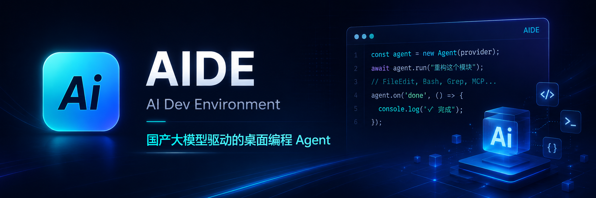
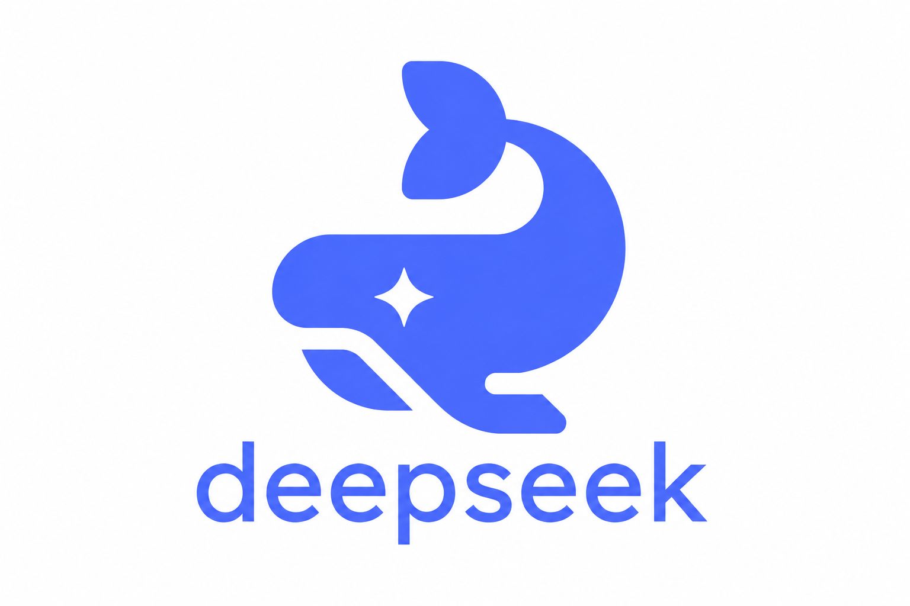
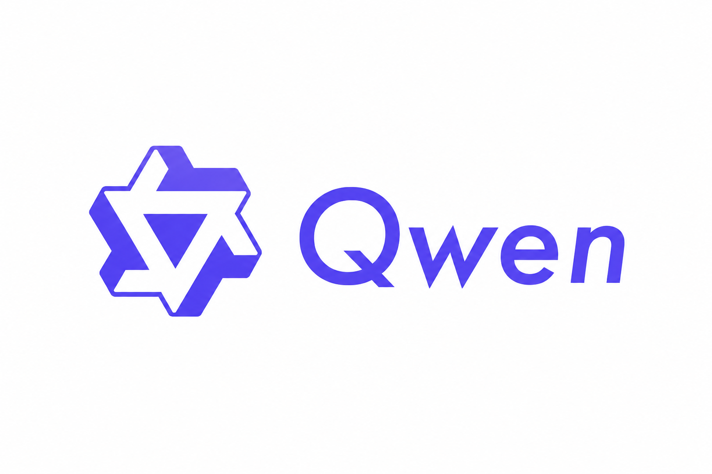
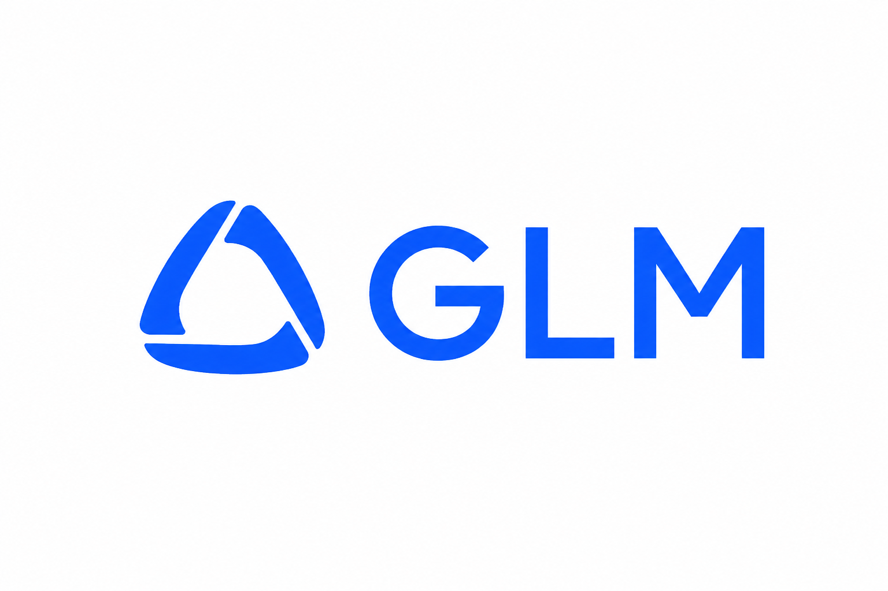
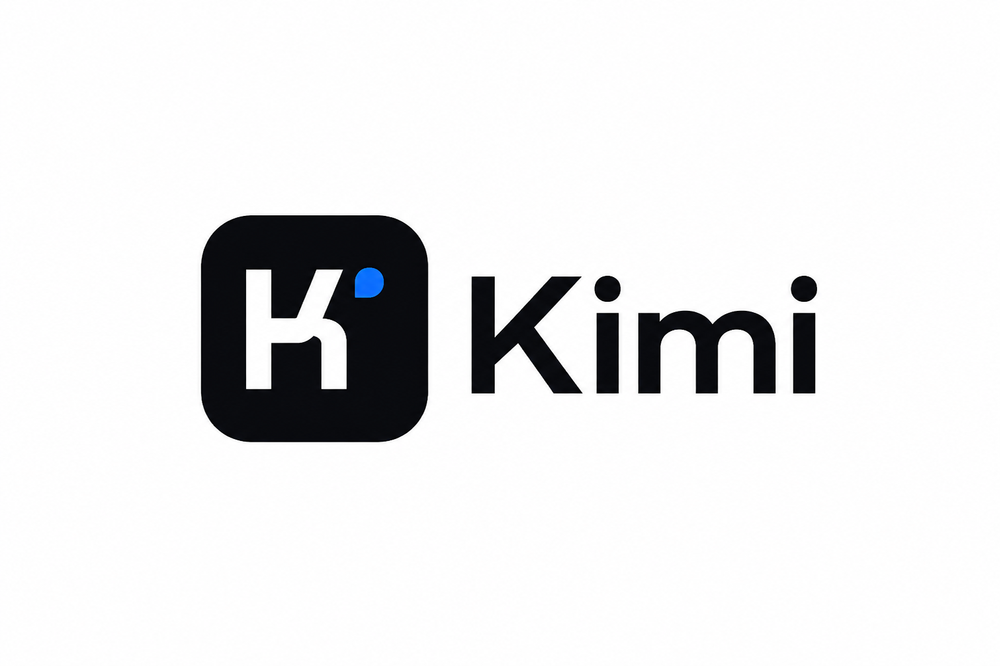
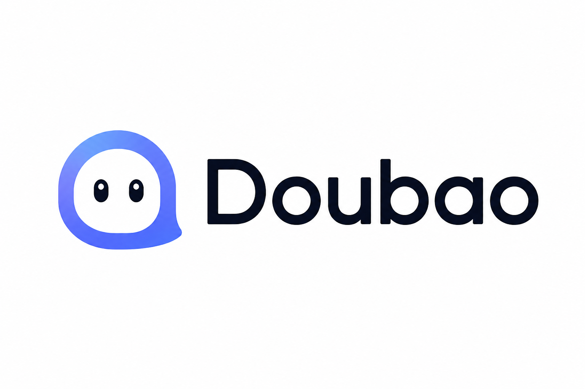
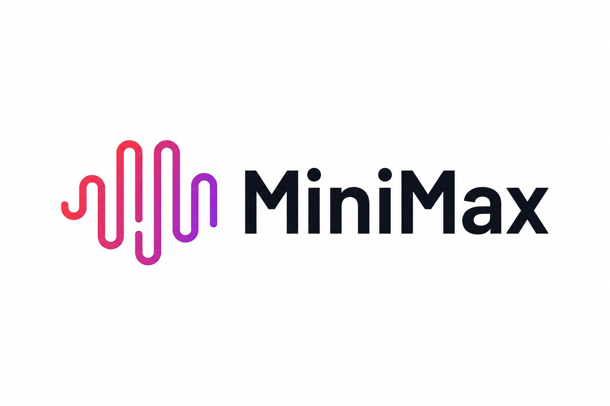

<p align="center">
  
</p>

<h1 align="center">AIDE_DEV — AI Dev Environment</h1>

<p align="center">
  <strong>A desktop coding agent for Chinese LLMs — feature-parity with Claude Code and Codex, now maintained under the AIDE_DEV public name</strong>
</p>

<p align="center">
  <a href="README.md">English</a> | <a href="README.zh-CN.md">中文</a> | <a href="README.ja.md">日本語</a> | <a href="README.ko.md">한국어</a>
</p>

<p align="center">
  
  
  
  
  
</p>

<p align="center">
  
  &nbsp;&nbsp;
  
  &nbsp;&nbsp;
  
  &nbsp;&nbsp;
  
  &nbsp;&nbsp;
  
  &nbsp;&nbsp;
  
</p>

---

## Download

<p align="center">

| Platform | Installer | Portable |
|---|---|---|
| **Windows x64** | [AiDE-0.1.0-x64-setup.exe](https://github.com/appleweiping/AIDE_DEV/releases/latest/download/AiDE-0.1.0-x64-setup.exe) | [AiDE-0.1.0-x64.zip](https://github.com/appleweiping/AIDE_DEV/releases/latest/download/AiDE-0.1.0-x64.zip) |
| **Windows arm64** | [AiDE-0.1.0-arm64-setup.exe](https://github.com/appleweiping/AIDE_DEV/releases/latest/download/AiDE-0.1.0-arm64-setup.exe) | [AiDE-0.1.0-arm64.zip](https://github.com/appleweiping/AIDE_DEV/releases/latest/download/AiDE-0.1.0-arm64.zip) |
| **macOS (Apple Silicon)** | [AiDE-0.1.0-aarch64.dmg](https://github.com/appleweiping/AIDE_DEV/releases/latest/download/AiDE-0.1.0-aarch64.dmg) | — |
| **macOS (Intel)** | [AiDE-0.1.0-x64.dmg](https://github.com/appleweiping/AIDE_DEV/releases/latest/download/AiDE-0.1.0-x64.dmg) | — |
| **Linux x64** | [AiDE-0.1.0-amd64.AppImage](https://github.com/appleweiping/AIDE_DEV/releases/latest/download/AiDE-0.1.0-amd64.AppImage) | [AiDE-0.1.0-amd64.deb](https://github.com/appleweiping/AIDE_DEV/releases/latest/download/AiDE-0.1.0-amd64.deb) |
| **Linux arm64** | [AiDE-0.1.0-arm64.AppImage](https://github.com/appleweiping/AIDE_DEV/releases/latest/download/AiDE-0.1.0-arm64.AppImage) | [AiDE-0.1.0-arm64.deb](https://github.com/appleweiping/AIDE_DEV/releases/latest/download/AiDE-0.1.0-arm64.deb) |
| **CLI (npm)** | `npm install -g @aide-dev/cli` | — |

</p>

> All releases are on the [GitHub Releases](https://github.com/appleweiping/AIDE_DEV/releases) page. The desktop app auto-updates when a new version is available.

---

## What is AiDE?

AiDE is an open-source desktop coding agent that brings the power of Claude Code and Codex to Chinese LLMs. It runs natively on Windows, macOS, and Linux via a lightweight Tauri shell (~5 MB), and connects to DeepSeek, Qwen, GLM, Kimi, Doubao, MiniMax, or any OpenAI-compatible API endpoint. The full agent loop — file editing, shell execution, web search, Git operations, MCP tools, and more — runs locally on your machine with a three-tier permission system that keeps you in control.

The 2026-06-04 upgrade pass ran Universal Upgrade Forge for 108 iterations and
materialized the public project identity as `AIDE_DEV`. See
[`docs/releases/2026-06-04-uupf-aide-dev-upgrade.md`](docs/releases/2026-06-04-uupf-aide-dev-upgrade.md).

## Why AiDE?

| | Claude Code | Codex | **AiDE** |
|---|---|---|---|
| Model support | Claude only | GPT only | **6 Chinese LLMs + any OpenAI-compatible API** |
| Desktop size | Electron (~150 MB) | Electron | **Tauri (~5 MB)** |
| Open source | No | Partial | **Yes — Apache-2.0** |
| Chinese optimization | Basic | Basic | **Native Chinese UI + Chinese model presets** |
| Custom API endpoint | Requires workaround | Requires workaround | **First-class `base_url` + key support** |
| Pricing | $20/month+ | $20/month+ | **Pay-as-you-go; as low as ¥0.001/call with Chinese models** |
| Thinking / reasoning | Claude 3.7+ | o1/o3 | **DeepSeek R1, QwQ Plus** |
| Vision | Claude 3+ | GPT-4V | **Qwen, GLM, Doubao** |
| Context window | 200K | 128K | **Up to 1M tokens (MiniMax)** |

## Screenshots

<!-- screenshots coming soon -->

---

## Features

### Agent Capabilities

AiDE ships 15 built-in tools that cover the full coding workflow:

| Tool | Description |
|---|---|
| **FileRead** | Read any file with line-number offsets; supports images, PDFs, and Jupyter notebooks |
| **FileWrite** | Create or overwrite files atomically |
| **FileEdit** | Precise string-replacement editing — no full rewrites needed |
| **Bash** | Execute shell commands with timeout control and background mode |
| **PowerShell** | Windows PowerShell execution with the same safety controls as Bash |
| **Glob** | Fast file-pattern matching across large codebases |
| **Grep** | Regex content search powered by ripgrep |
| **WebSearch** | Live web search for up-to-date information |
| **WebFetch** | Fetch and parse URL content for the agent |
| **NotebookEdit** | Edit individual cells in Jupyter `.ipynb` files |
| **Monitor** | Stream stdout from a background process; each line fires an event |
| **NodeREPL** | Persistent JavaScript execution environment with state across calls |
| **Cron** | Schedule one-shot or recurring jobs with cron expressions |
| **AskUser** | Pause the agent loop and prompt the user with a multiple-choice question |
| **SubAgent** | Spawn parallel sub-agents for independent subtasks |

### Desktop Application

The desktop app is built with Tauri v2 + React and organized into the following panels:

**Chat & Sessions**
- `Chat` — streaming message view with tool-call rendering and diff previews
- `SessionList` — browse, search, and restore past conversations
- `SessionTabs` — multi-tab interface (Ctrl+T / Ctrl+W); rename, duplicate, close-others via context menu
- `TokenUsage` — live input/output token counter with estimated cost in the status bar

**Code Review & Diff**
- Visual diff viewer with line-level accept / reject / edit per hunk
- Syntax-highlighted side-by-side or unified view

**Project Management**
- `FileExplorer` — collapsible file tree with click-to-open (Ctrl+B)
- `GitPanel` — branch list, commit history, staging area, PR creation
- `WorktreePanel` — create and switch Git worktrees for isolated experiments
- `RagPanel` — local TF-IDF index search across the project

**Automation & Agents**
- `Terminal` — embedded xterm.js terminal (Ctrl+\`)
- `TaskList` — floating task checklist with real-time progress
- `SubAgentPanel` — monitor and manage parallel sub-agent runs
- `McpManager` — connect, configure, and inspect MCP tool servers
- `PluginMarketplace` — browse, install, and update plugins

**Settings & System**
- `Settings` — provider selection, API key, model, permission mode, theme
- `CommandPalette` — fuzzy-search command launcher (Ctrl+Shift+P)
- `ApprovalDialog` — modal for dangerous-operation approval with "remember choice"
- `UpdateNotification` — in-app update banner with skip-version support
- System tray integration for background operation

### Provider Support

| Provider | Models | Context Window | Tool Use | Thinking | Vision |
|---|---|---|---|---|---|
| **DeepSeek** | deepseek-chat (V3), deepseek-reasoner (R1) | 64K | V3 only | R1 | No |
| **Qwen (Alibaba)** | qwen-max, qwen-plus, qwq-plus | 32K – 131K | Yes | QwQ | Yes |
| **GLM (Zhipu)** | glm-4-plus, glm-4-flash | 128K | Yes | No | Yes |
| **Kimi (Moonshot)** | moonshot-v1-128k, moonshot-v1-32k | 32K – 128K | Yes | No | No |
| **Doubao (ByteDance)** | doubao-1.5-pro-256k, doubao-1.5-lite-32k | 32K – 256K | Yes | No | Yes |
| **MiniMax** | MiniMax-Text-01 | 1,000,000 | Yes | No | No |
| **Custom** | Any model | Configurable | Depends on endpoint | Depends | Depends |

### Extensibility

- **MCP Protocol** — connect any MCP tool server; AiDE implements the full client spec including tool discovery, resource reading, and multi-server parallel connections
- **Plugin System** — plugins are standard npm packages; register custom tools, commands, and UI panels
- **VS Code Extension** — use AiDE's agent from inside VS Code (Phase 3)
- **OpenAI-compatible API** — any provider that speaks the OpenAI chat completions format works out of the box

### Safety & Permissions

AiDE uses a three-tier permission model:

| Mode | Behavior |
|---|---|
| **Safe** (default) | All file writes and shell commands require explicit approval |
| **Trusted** | Approved commands run automatically; only novel high-risk operations prompt |
| **Locked** | Read-only mode; no writes or shell execution allowed |

The approval system classifies commands by risk level, shows a modal with the full command before execution, and lets you "remember this choice" for the session. The file sandbox restricts writes to the configured working directory.

---

## Quick Start

### Prerequisites

- Node.js 22 or later
- pnpm 9 or later
- Rust stable toolchain (for compiling the Tauri shell — install via [rustup.rs](https://rustup.rs))
- Windows 10+ / macOS 12+ / Ubuntu 20.04+

### Install and Run

```bash
# Clone the repository
git clone https://github.com/appleweiping/AIDE_DEV.git
cd aide

# Install all workspace dependencies
pnpm install

# Start the desktop app in development mode (hot reload)
pnpm --filter @aide/desktop tauri dev

# Or use the CLI only (no Rust required)
pnpm --filter @aide/cli dev -- --provider deepseek --key sk-xxx "Explain this project's architecture"
```

### Production Build

```bash
# Build the desktop installer
pnpm --filter @aide/desktop tauri build

# Output locations:
# Windows:  packages/desktop/src-tauri/target/release/bundle/msi/
# macOS:    packages/desktop/src-tauri/target/release/bundle/dmg/
# Linux:    packages/desktop/src-tauri/target/release/bundle/appimage/
```

---

## Configuration

### First Launch

On first launch, open the Settings panel (gear icon or Ctrl+Shift+P → "Settings"):

1. Select a provider from the dropdown
2. Enter your API key
3. Choose a model
4. Click "Test Connection"

### Config File

AiDE stores its configuration at `~/.aide/config.toml`:

```toml
[provider]
id = "deepseek"
base_url = "https://api.deepseek.com"
api_key = "sk-xxx"
model = "deepseek-chat"

[agent]
max_iterations = 50
thinking_enabled = true
permission_mode = "safe"   # safe | trusted | locked

[[mcp.servers]]
name = "filesystem"
command = "npx"
args = ["-y", "@modelcontextprotocol/server-filesystem", "./"]

[[mcp.servers]]
name = "github"
command = "npx"
args = ["-y", "@modelcontextprotocol/server-github"]
env = { GITHUB_TOKEN = "ghp_xxx" }
```

### Environment Variables

| Variable | Description |
|---|---|
| `AIDE_PROVIDER` | Default provider ID (e.g. `deepseek`) |
| `AIDE_API_KEY` | API key (overrides config file) |
| `AIDE_BASE_URL` | Custom API base URL |
| `AIDE_MODEL` | Model ID to use |
| `AIDE_PERMISSION_MODE` | `safe`, `trusted`, or `locked` |
| `AIDE_WORK_DIR` | Working directory for the agent |
| `AIDE_MAX_ITERATIONS` | Maximum agent loop iterations (default: 50) |

### Provider Setup

<details>
<summary>DeepSeek</summary>

1. Sign up at [platform.deepseek.com](https://platform.deepseek.com)
2. Create an API key under "API Keys"
3. In AiDE Settings, select **DeepSeek** and paste the key
4. Recommended model: `deepseek-chat` for coding tasks, `deepseek-reasoner` for complex reasoning

</details>

<details>
<summary>Qwen (Alibaba Cloud)</summary>

1. Sign up at [dashscope.console.aliyun.com](https://dashscope.console.aliyun.com)
2. Enable DashScope and create an API key
3. Select **Qwen** in AiDE Settings
4. Recommended: `qwq-plus` for reasoning, `qwen-plus` for long-context tasks (131K)

</details>

<details>
<summary>GLM (Zhipu AI)</summary>

1. Register at [open.bigmodel.cn](https://open.bigmodel.cn)
2. Create an API key in the console
3. Select **GLM** in AiDE Settings
4. `glm-4-plus` supports 128K context and vision

</details>

<details>
<summary>Kimi (Moonshot AI)</summary>

1. Register at [platform.moonshot.cn](https://platform.moonshot.cn)
2. Create an API key
3. Select **Kimi** in AiDE Settings
4. `moonshot-v1-128k` is ideal for large codebases

</details>

<details>
<summary>Doubao (ByteDance)</summary>

1. Sign up at [console.volcengine.com/ark](https://console.volcengine.com/ark)
2. Create an API key in the Ark console
3. Select **Doubao** in AiDE Settings
4. `doubao-1.5-pro-256k` offers 256K context with vision support

</details>

<details>
<summary>MiniMax</summary>

1. Register at [platform.minimaxi.com](https://platform.minimaxi.com)
2. Create an API key
3. Select **MiniMax** in AiDE Settings
4. `MiniMax-Text-01` provides a 1M token context window

</details>

<details>
<summary>Custom / Self-hosted</summary>

Any OpenAI-compatible endpoint works. In AiDE Settings, select **Custom** and fill in:
- Base URL (e.g. `http://localhost:11434/v1` for Ollama)
- API key (use any string if the endpoint doesn't require one)
- Model ID

</details>

---

## CLI Reference

```bash
aide [options] [prompt]
```

| Flag | Short | Description |
|---|---|---|
| `--provider <id>` | `-p` | Provider ID: `deepseek`, `qwen`, `glm`, `kimi`, `doubao`, `minimax`, `custom` |
| `--key <key>` | `-k` | API key |
| `--base-url <url>` | | Custom API base URL (for custom provider) |
| `--model <id>` | `-m` | Model ID |
| `--dir <path>` | `-d` | Working directory (default: current directory) |
| `--thinking` | | Enable thinking/reasoning mode |
| `--permission <mode>` | | Permission mode: `safe`, `trusted`, `locked` |
| `--max-iter <n>` | | Maximum agent iterations (default: 50) |
| `--interactive` | `-i` | Start interactive REPL session |
| `--version` | `-v` | Print version and exit |
| `--help` | `-h` | Show help |

**Examples:**

```bash
# One-shot task
aide "Add unit tests for src/utils.ts" --provider deepseek --key sk-xxx

# Interactive session
aide -p qwen -k sk-xxx -i

# Custom endpoint (e.g. local Ollama)
aide --base-url http://localhost:11434/v1 --key ollama --model llama3.2 "Refactor this file"

# Specify working directory
aide -d /path/to/project "Add a README"

# Enable reasoning mode
aide --thinking --provider deepseek --key sk-xxx "Design a distributed cache"

# Trusted mode (fewer approval prompts)
aide --permission trusted -p deepseek -k sk-xxx "Run the test suite and fix failures"
```

---

## Architecture

```
┌─────────────────────────────────────────────────────────────┐
│                     Desktop (Tauri v2)                        │
│  ┌──────────┐ ┌──────┐ ┌──────────┐ ┌───────┐ ┌─────────┐  │
│  │   Chat   │ │ Diff │ │ Terminal │ │ Files │ │Settings │  │
│  │ Sessions │ │ View │ │ xterm.js │ │  Git  │ │   MCP   │  │
│  └────┬─────┘ └──┬───┘ └────┬─────┘ └───┬───┘ └────┬────┘  │
│       └──────────┴──────────┴───────────┴──────────┘        │
│                          │ IPC (JSON-RPC over stdio)          │
└──────────────────────────┼──────────────────────────────────┘
                           │
┌──────────────────────────┼──────────────────────────────────┐
│                    Core Engine (Node.js 22)                   │
│  ┌────────────┐  ┌───────────┐  ┌───────────┐  ┌─────────┐  │
│  │  Provider  │  │   Agent   │  │   Tools   │  │   MCP   │  │
│  │  Registry  │  │   Loop    │  │ Registry  │  │ Manager │  │
│  └────────────┘  └───────────┘  └───────────┘  └─────────┘  │
│  ┌────────────┐  ┌───────────┐  ┌───────────┐  ┌─────────┐  │
│  │  Session   │  │  Safety   │  │  Plugin   │  │   Git   │  │
│  │  Manager  │  │  Sandbox  │  │  System   │  │   Ops   │  │
│  └────────────┘  └───────────┘  └───────────┘  └─────────┘  │
│  ┌────────────┐  ┌───────────┐  ┌───────────┐  ┌─────────┐  │
│  │    RAG     │  │ Sub-Agent │  │   Plan    │  │  Auto   │  │
│  │  Indexer  │  │  Manager  │  │  Manager  │  │ Updater │  │
│  └────────────┘  └───────────┘  └───────────┘  └─────────┘  │
└──────────────────────────┬──────────────────────────────────┘
                           │
           ┌───────────────┼───────────────┐
           ▼               ▼               ▼
       DeepSeek          Qwen           GLM / Kimi / Doubao / MiniMax / Custom
```

### Tech Stack

| Layer | Technology | Notes |
|---|---|---|
| Desktop shell | Tauri v2 (Rust) | Native window, system tray, IPC bridge |
| Frontend | React + TypeScript + Tailwind CSS | Dark theme, VS Code color palette |
| Terminal emulator | xterm.js | Full ANSI support, resize-aware |
| Core engine | TypeScript on Node.js 22 | Agent loop, tool execution, streaming |
| Session storage | JSON files → SQLite (Phase 2) | SQLiteSessionStore already implemented |
| Local search | TF-IDF indexer | File chunking, language detection, serializable index |
| Build system | pnpm + Turborepo + tsdown | Monorepo with incremental builds |
| CI/CD | GitHub Actions | Three-platform build and release |

### Package Structure

| Package | Path | Description |
|---|---|---|
| `@aide/core` | `packages/core` | Agent loop, all tools, providers, MCP, plugins, RAG |
| `@aide/shared` | `packages/shared` | Types, constants, provider presets shared across packages |
| `@aide/desktop` | `packages/desktop` | Tauri + React desktop application |
| `@aide/cli` | `packages/cli` | Command-line interface |
| `@aide/vscode` | `packages/vscode` | VS Code extension (Phase 3) |

---

## Tool Reference

All 15 built-in tools and their Claude Code / Codex equivalents:

| Tool | Description | CC Equivalent | Codex Equivalent |
|---|---|---|---|
| `FileRead` | Read files with offset/limit; handles images, PDFs, notebooks | `Read` | `read_file` |
| `FileWrite` | Create or overwrite a file | `Write` | `write_file` |
| `FileEdit` | Exact string-replacement edit (fails if string not unique) | `Edit` | `edit_file` |
| `Bash` | Run shell commands; supports background and timeout | `Bash` | `shell` |
| `PowerShell` | Windows PowerShell execution | `PowerShell` | — |
| `Glob` | File pattern matching, sorted by modification time | `Glob` | `glob` |
| `Grep` | Regex content search via ripgrep; supports context lines | `Grep` | `grep` |
| `WebSearch` | Live web search | `WebSearch` | `web_search` |
| `WebFetch` | Fetch and extract content from a URL | `WebFetch` | `web_fetch` |
| `NotebookEdit` | Edit, insert, or delete Jupyter notebook cells | `NotebookEdit` | — |
| `Monitor` | Stream stdout from a background process | `Monitor` | — |
| `NodeREPL` | Persistent JavaScript REPL with state across calls | — | `repl` |
| `Cron` | Schedule jobs with cron expressions | — | — |
| `AskUser` | Pause and prompt the user with a multiple-choice question | — | — |
| `SubAgent` | Spawn a parallel sub-agent for an independent subtask | — | — |

---

## Keyboard Shortcuts

| Shortcut | Action |
|---|---|
| `Ctrl+Shift+P` | Open Command Palette |
| `Ctrl+B` | Toggle File Explorer sidebar |
| `Ctrl+\`` | Toggle embedded Terminal |
| `Ctrl+T` | Open new session tab |
| `Ctrl+W` | Close active session tab |
| `Ctrl+Enter` | Send message (in chat input) |
| `Escape` | Close modal / Command Palette |
| `Ctrl+L` | Clear current session messages |

---

## Plugin Development

Plugins are npm packages that export a manifest and register tools or commands with AiDE's core engine.

### Minimal Plugin

```typescript
// package.json
{
  "name": "aide-plugin-hello",
  "version": "1.0.0",
  "main": "dist/index.js",
  "aidePlugin": true
}

// src/index.ts
import type { PluginContext, PluginManifest } from '@aide/core';

export const manifest: PluginManifest = {
  id: 'hello',
  name: 'Hello Plugin',
  version: '1.0.0',
  description: 'A minimal AiDE plugin example',
};

export async function activate(ctx: PluginContext) {
  ctx.tools.register({
    name: 'hello_world',
    description: 'Greet the user',
    inputSchema: {
      type: 'object',
      properties: {
        name: { type: 'string', description: 'Name to greet' },
      },
      required: ['name'],
    },
    async execute({ name }) {
      return { content: `Hello, ${name}!` };
    },
  });
}
```

### Installing a Plugin

```bash
# From npm
aide plugin install aide-plugin-hello

# From a local path
aide plugin install ./my-plugin

# Via the Plugin Marketplace UI
# Open Command Palette → "Open Plugin Marketplace"
```

### Plugin API

The `PluginContext` object provides:

- `ctx.tools` — register and unregister tools
- `ctx.commands` — register Command Palette entries
- `ctx.sessions` — read and write session data
- `ctx.config` — read plugin configuration
- `ctx.events` — subscribe to agent lifecycle events

---

## MCP Integration

AiDE implements the full [Model Context Protocol](https://modelcontextprotocol.io) client spec. Connect any MCP server to extend the agent with additional tools and resources.

### Configuration

Add servers to `~/.aide/config.toml`:

```toml
[[mcp.servers]]
name = "filesystem"
command = "npx"
args = ["-y", "@modelcontextprotocol/server-filesystem", "/home/user/projects"]

[[mcp.servers]]
name = "github"
command = "npx"
args = ["-y", "@modelcontextprotocol/server-github"]
env = { GITHUB_TOKEN = "ghp_xxx" }

[[mcp.servers]]
name = "postgres"
command = "npx"
args = ["-y", "@modelcontextprotocol/server-postgres", "postgresql://localhost/mydb"]
```

### Supported MCP Features

- Tool discovery and invocation
- Resource reading (files, database records, API responses)
- Multi-server parallel connections
- Server health monitoring via the MCP Manager UI

### MCP Manager UI

Open the MCP Manager from the sidebar header or via Command Palette → "Open MCP Manager". From there you can:

- Add and remove servers
- View connection status and tool list for each server
- Restart a failed server
- Inspect tool schemas

---

## Background Daemon & Mobile Remote Control

### Background Daemon (Screen-off Operation)

AiDE runs a persistent background daemon so agents keep working even when the desktop window is closed or the screen is off — the same pattern as Codex's `app-server`.

```bash
# Start the daemon (runs on ws://127.0.0.1:7432)
aide daemon start

# Check status
aide daemon status

# Stop
aide daemon stop
```

When you close the AiDE desktop window, it minimizes to the system tray. The Node.js core engine keeps running as a WebSocket server. Reopen the window at any time to reconnect — your sessions and running agents are still there.

The daemon writes a PID file to `~/.aide/daemon.pid` and logs to `~/.aide/daemon.log`.

### Mobile Remote Control

Control AiDE from your phone while agents run on your desktop.

**Architecture:**

```
Desktop daemon ──ws──▶ Relay server ◀──ws── AiDE mobile app
                       (self-hosted or
                        LAN via Tailscale)
```

**Setup:**

1. Start the relay server (self-host or use LAN):
   ```bash
   npx @aide-dev/relay   # default port 7433
   ```

2. In the AiDE desktop app, open **Settings → Remote Control** to see the QR code.

3. Open the AiDE mobile app, tap **Connect**, and scan the QR code.

**Mobile app features:**
- View all sessions and switch between them
- Send messages and receive streaming responses
- Approve or deny tool calls (bash commands, file writes) from your phone
- Receive push notifications via [ntfy](https://ntfy.sh) when tasks complete

**Push notifications (ntfy):**

```toml
# ~/.aide/config.toml
[notifications]
ntfy_topic = "my-aide-abc123"   # pick something unguessable
```

Install the free [ntfy app](https://ntfy.sh) on iOS or Android and subscribe to your topic. AiDE sends a notification whenever an agent finishes a task or needs your approval.

**Mobile app download:**

| Platform | Link |
|---|---|
| iOS | App Store (coming soon) |
| Android | Google Play (coming soon) / [APK](https://github.com/appleweiping/AIDE_DEV/releases/latest) |

The mobile app source is in `packages/mobile/` — build it yourself with Expo:

```bash
cd packages/mobile
pnpm install
npx expo start          # run in Expo Go for development
npx eas build           # build production APK/IPA
```

---

## VS Code Extension

The AiDE VS Code extension (Phase 3) lets you run the agent directly from the editor.

### Installation

```bash
# From the VS Code Marketplace (when available)
code --install-extension aide-dev.aide

# Or install the .vsix manually
code --install-extension aide-0.1.0.vsix
```

### Usage

- Open the AiDE panel from the Activity Bar
- The extension reuses your `~/.aide/config.toml` configuration
- All 15 tools are available, with the workspace root as the working directory
- Diffs appear inline in the editor using VS Code's native diff viewer

---

## Roadmap

### Phase 1 — Foundation (complete)

- [x] Desktop app with chat interface
- [x] 6 Chinese LLM provider presets
- [x] Full tool suite (15 tools)
- [x] Three-tier permission system with approval dialogs
- [x] Session persistence (JSON)
- [x] Bilingual UI (English + Chinese)
- [x] Visual Diff viewer
- [x] Plan Mode
- [x] Command Palette
- [x] MCP client
- [x] Plugin system

### Phase 2 — Collaboration (complete)

- [x] MCP Manager UI
- [x] Git workflow panel (branches, commits, PRs)
- [x] Sub-agent parallel task execution
- [x] Auto-updater
- [x] SQLite session store
- [x] Session tabs (multi-tab interface)
- [x] Worktree panel

### Phase 3 — Intelligence (complete)

- [x] Plugin Marketplace
- [x] Worktree sandbox
- [x] RAG local indexing (TF-IDF)
- [x] VS Code extension scaffold
- [x] Sub-agent panel UI

### Phase 4 — Future

- [ ] Mobile companion app (iOS / Android)
- [ ] Voice input and text-to-speech output
- [ ] Collaborative mode (shared sessions, multi-user)
- [ ] Cloud sync for sessions and settings
- [ ] Fine-tuned tool-use models for Chinese LLMs
- [ ] Semantic RAG (vector embeddings, not just TF-IDF)

---

## Contributing

See [CONTRIBUTING.md](CONTRIBUTING.md) for the full guide.

### Adding a New Provider

All Chinese LLMs use the OpenAI-compatible chat completions format. To add a new provider, append an entry to the `PROVIDER_PRESETS` array in `packages/shared/src/constants.ts`:

```typescript
{
  id: 'myprovider',
  name: 'My Provider',
  nameZh: '我的提供商',
  baseUrl: 'https://api.myprovider.com/v1',
  supportsToolUse: true,
  supportsThinking: false,
  supportsVision: false,
  models: [
    { id: 'my-model-v1', name: 'My Model V1', contextWindow: 128000, supportsToolUse: true, supportsThinking: false },
  ],
}
```

### Adding a New Tool

1. Create `packages/core/src/tools/my-tool.ts` and export a `ToolDefinition` and `execute` function
2. Export it from `packages/core/src/tools/index.ts`
3. Export it from `packages/core/src/index.ts`
4. Add an entry to the Tool Reference table in this README

---

## FAQ

**Q: Do I need a paid subscription to use AiDE?**
No. AiDE is free and open source. You pay only for the API calls you make to your chosen provider. DeepSeek V3 costs roughly ¥0.001 per 1K tokens — orders of magnitude cheaper than Claude Code or Codex subscriptions.

**Q: Does AiDE send my code to any third-party servers?**
AiDE sends only the messages you explicitly send to the LLM provider you configure. No telemetry, no analytics, no data collection. The agent runs entirely on your machine.

**Q: Can I use AiDE with a local model (Ollama, LM Studio)?**
Yes. Select "Custom" as the provider, set the base URL to your local server (e.g. `http://localhost:11434/v1`), and enter any string as the API key. Tool use depends on whether your local model supports the OpenAI function-calling format.

**Q: How does AiDE compare to Cursor or Windsurf?**
Cursor and Windsurf are full IDE replacements. AiDE is a standalone agent that works alongside your existing editor. It's closer to Claude Code or Codex in philosophy — a terminal/desktop agent you invoke for specific tasks.

**Q: The Tauri build fails on my machine. What should I do?**
Make sure you have the Rust stable toolchain installed (`rustup toolchain install stable`). On Windows, you also need the MSVC build tools (Visual Studio Build Tools 2022). See the [Tauri prerequisites guide](https://tauri.app/start/prerequisites/) for platform-specific instructions.

**Q: Can I run multiple providers simultaneously?**
Not in a single session, but you can switch providers between sessions or configure a fallback chain in `config.toml`. Sub-agent tasks can use different providers than the main agent.

---

## License

[Apache-2.0](LICENSE) — free to use, modify, and distribute, including for commercial purposes.

---

## Acknowledgments

- [Tauri](https://tauri.app) — for making a 5 MB cross-platform desktop app possible
- [React](https://react.dev) and the React ecosystem
- [xterm.js](https://xtermjs.org) — the terminal emulator
- [DeepSeek](https://deepseek.com), [Alibaba Cloud](https://www.alibabacloud.com), [Zhipu AI](https://zhipuai.cn), [Moonshot AI](https://moonshot.cn), [ByteDance](https://bytedance.com), and [MiniMax](https://minimax.chat) — for building world-class LLMs and open APIs
- The [Model Context Protocol](https://modelcontextprotocol.io) team at Anthropic
- All contributors and early adopters
